# Nyora for Linux — Screenshots

These screenshots were captured running the packaged Nyora app on Ubuntu 24.04 (GNOME/Wayland via Xwayland).

### Reader

Reading a chapter in Nyora's distraction-free AMOLED reader.

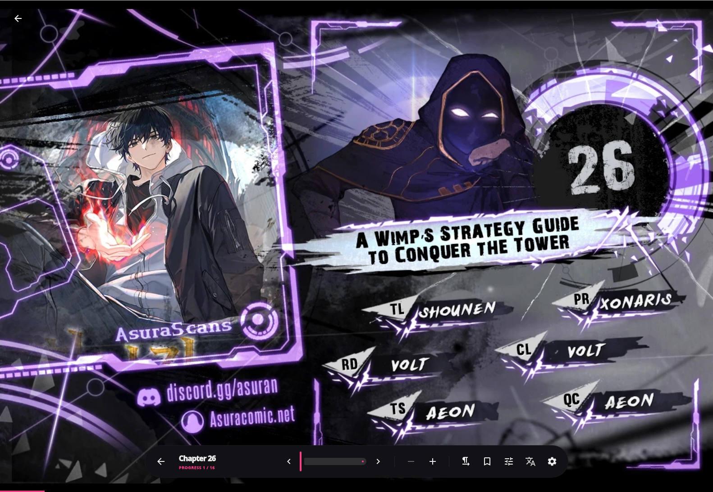

### Home

Nyora's Home screen on Linux — a Continue Reading shelf and a richly populated Discover grid in a sleek AMOLED dark theme.

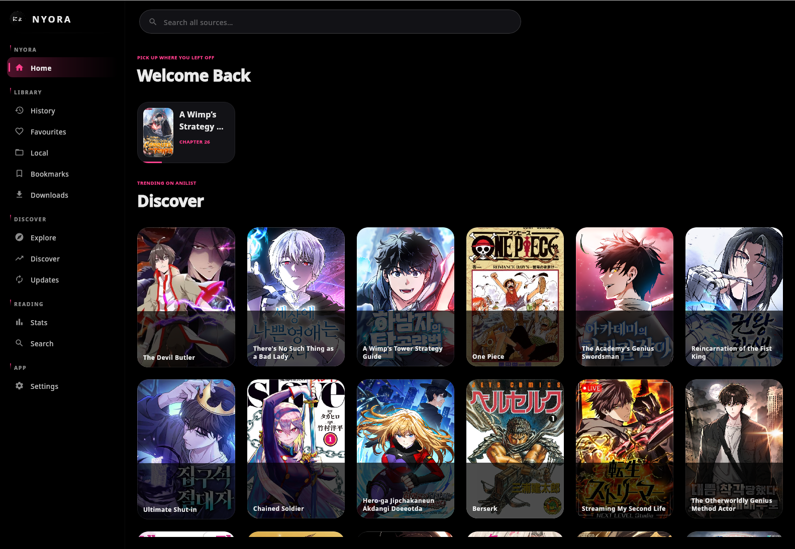

### Discover

Discover screen with a trending hero banner and a grid of popular manga, in Nyora's AMOLED dark theme.

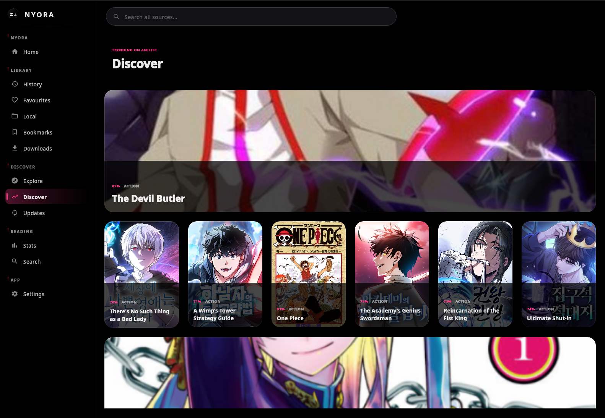

### Explore

Explore lets you browse 90+ manga sources from a searchable, pinnable catalogue in Nyora's AMOLED dark theme.

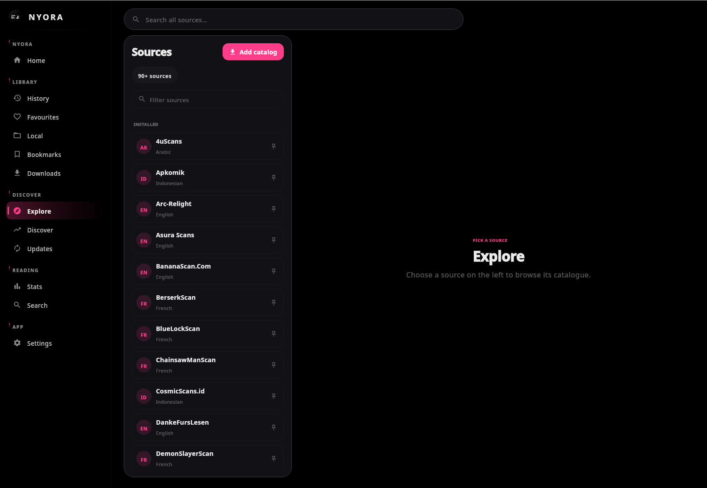

### Details

The manga details screen with cover art, synopsis, genre tags, and a scrollable chapter list in Nyora's AMOLED dark theme.

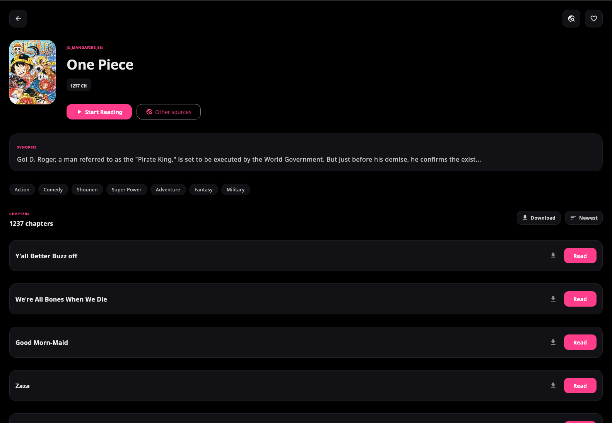

### History

The History view picks up right where you left off, showing recently read titles with timestamps and per-chapter progress.

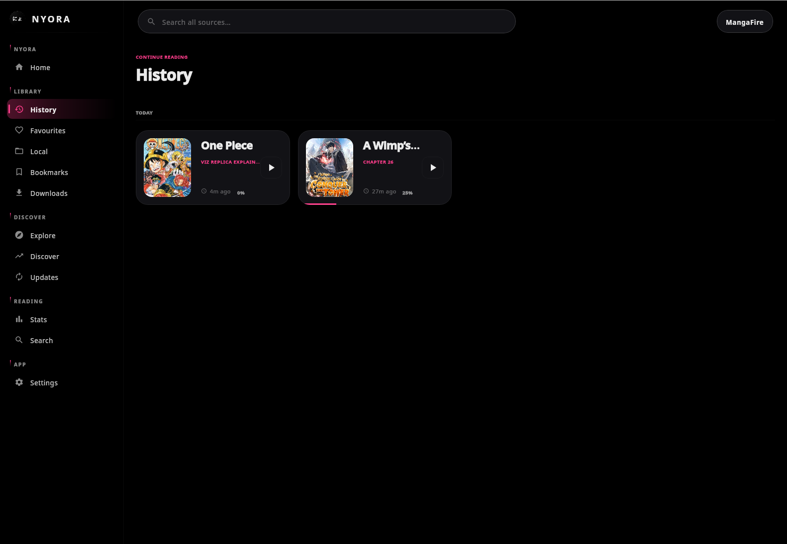

### Search

Global search across all sources — results for "One Piece" shown as a cover grid on Nyora's AMOLED dark theme.

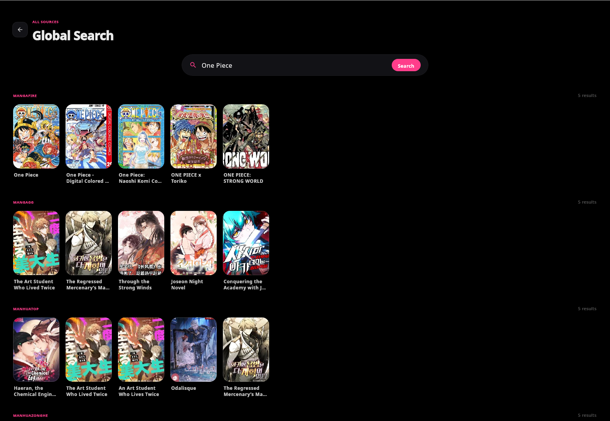

### Stats

The Statistics dashboard surfaces your reading life at a glance — day streak, chapters read, manga and favourites counts, and your top sources.

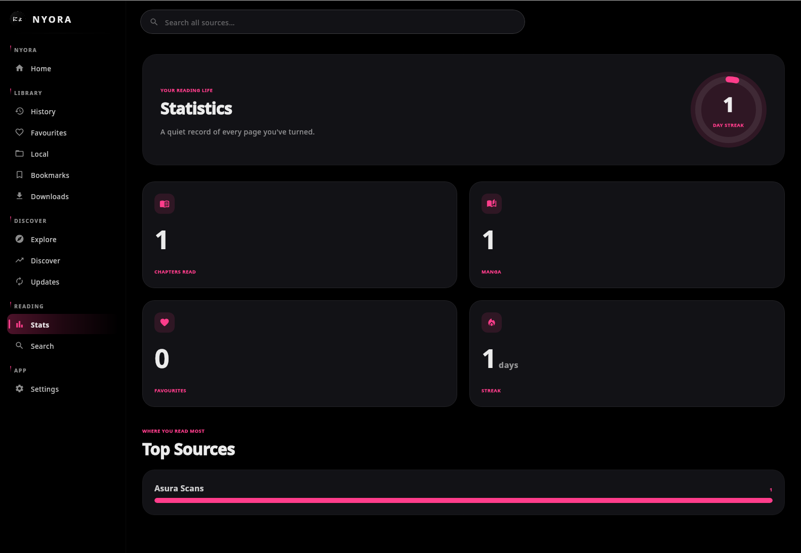

### Library

The Library screen with the Favourites tab selected, showing Nyora's AMOLED dark theme, pink-accented sidebar navigation, and a friendly empty-library state.

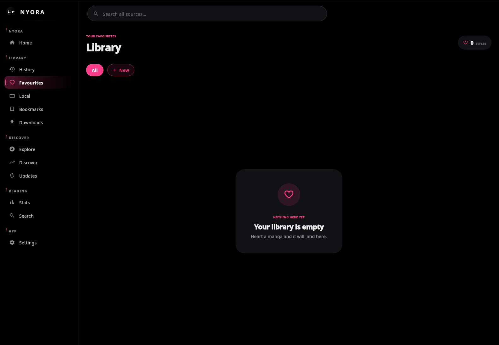

### Updates

The Updates screen tracks new chapters across your history and favourites, showing an "all caught up" empty state in the AMOLED dark theme.

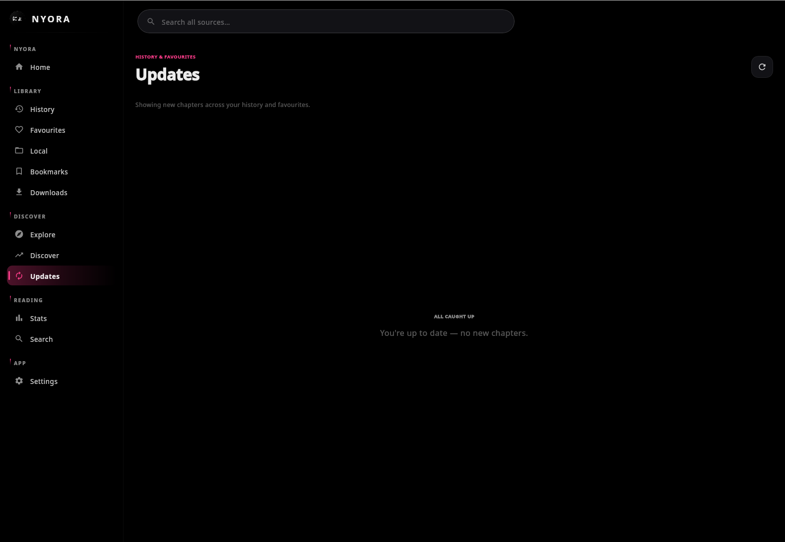

### Settings

The Settings screen in Nyora's AMOLED dark theme, with a categorized list covering appearance, reader, library, translation, cloud sync, and more.

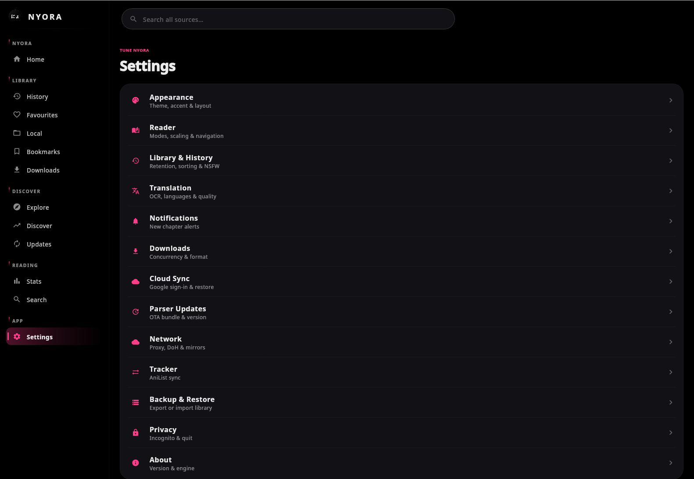
